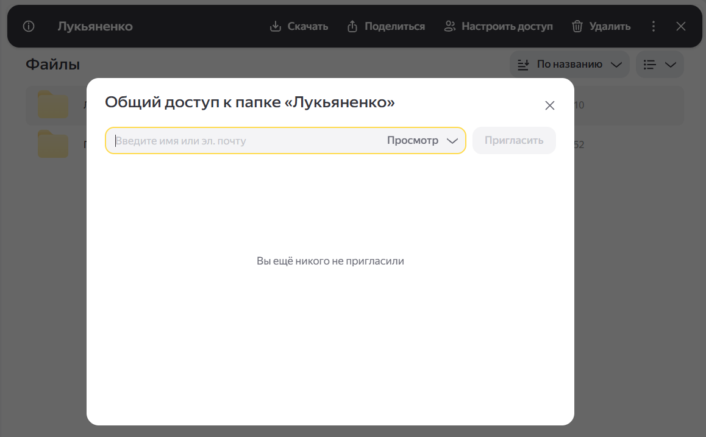
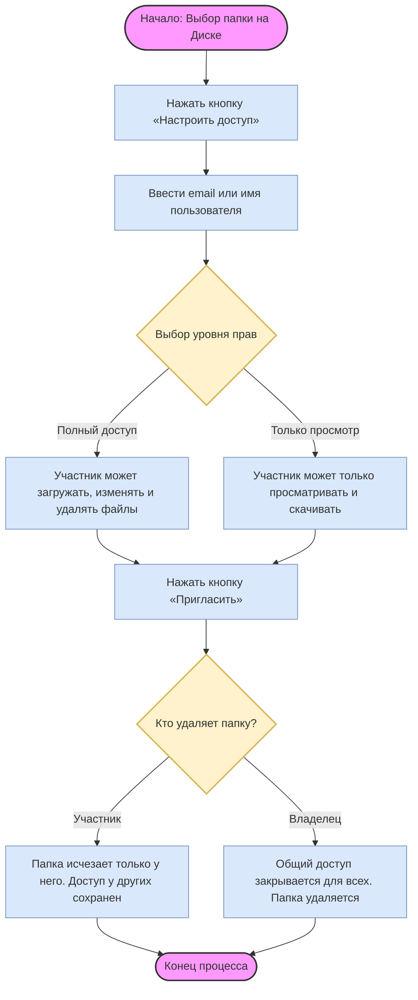

# Руководство пользователя: управление общими папками в сервисе «Яндекс Диск»

Это руководство поможет вам эффективно организовать совместную работу с файлами в Яндекс Диске. Здесь описаны основные сценарии: от создания общей папки до настройки прав доступа и решения типовых проблем.

## Оглавление

- [Руководство пользователя: управление общими папками в сервисе «Яндекс Диск»](#руководство-пользователя-управление-общими-папками-в-сервисе-яндексдиск)
  - [Оглавление](#оглавление)
  - [Что такое общая папка и как она работает](#что-такое-общая-папка-и-как-она-работает)
    - [Ключевые особенности](#ключевые-особенности)
  - [Как создать общую папку и пригласить участников](#как-создать-общую-папку-и-пригласить-участников)
    - [Пошаговая инструкция](#пошаговая-инструкция)
    - [Частые ошибки и подсказки](#частые-ошибки-и-подсказки)
  - [Управление правами доступа](#управление-правами-доступа)
    - [Что может участник: сравнение прав](#что-может-участник-сравнение-прав)
    - [Как изменить или отозвать доступ](#как-изменить-или-отозвать-доступ)
    - [Частые вопросы и нюансы](#частые-вопросы-и-нюансы)
  - [Действия с общей папкой: перемещение, переименование, удаление](#действия-с-общей-папкой-перемещение-переименование-удаление)
    - [Переименование и перемещение](#переименование-и-перемещение)
    - [Удаление общей папки](#удаление-общей-папки)
    - [Частые сценарии и что делать](#частые-сценарии-и-что-делать)
  - [Схема бизнес-процесса: Настройка общего доступа](#схема-бизнес-процесса-настройка-общего-доступа)
  - [Типовые проблемы и их решения](#типовые-проблемы-и-их-решения)
  - [Часто задаваемые вопросы (FAQ)](#часто-задаваемые-вопросы-faq)

## Что такое общая папка и как она работает

Общая папка в Яндекс Диске — это инструмент для совместной работы, который позволяет нескольким пользователям одновременно просматривать и редактировать файлы.

> [!NOTE]
> Общая папка занимает место только на Диске её **владельца** — того, кто её создал. У участников она отображается как копия, но не расходует их лимит места.

### Ключевые особенности

- Изменения, внесённые любым участником с полным доступом, мгновенно отображаются у всех остальных.
- Доступ настраивается индивидуально для каждого пользователя: «Только просмотр» или «Полный доступ».
- Любой участник может переименовать или переместить папку в другое место на своём Диске — это не повлияет на права доступа остальных.

> [!WARNING]
> Вложенные общие папки не поддерживаются. Нельзя создать общую папку внутри другой общей папки — и наоборот, поместить общую папку внутрь обычной общей папки.

## Как создать общую папку и пригласить участников

Настроить общий доступ можно только в веб‑версии Яндекс Диска на компьютере.

### Пошаговая инструкция

1. Откройте Яндекс Диск в браузере и войдите в свой аккаунт.
2. Выберите папку, к которой хотите открыть доступ.
3. На верхней панели нажмите кнопку **«Настроить доступ»**.

*(Альтернативно: кликните по папке правой кнопкой мыши и выберите пункт «Настроить доступ».)*

*Рис. 1. Окно настройки общего доступа к папке на Яндекс Диске.*

4. В появившемся окне введите email или имя пользователя Яндекса, которому хотите предоставить доступ.
5. Выберите уровень прав: **«Только просмотр»** или **«Полный доступ»**.
6. Нажмите кнопку **«Пригласить»**.

> **⚠️ Warning**  
> Если вы вводите email, убедитесь, что он точно привязан к аккаунту Яндекса. Приглашение, отправленное на почту без связанного аккаунта, не сработает.

### Частые ошибки и подсказки

- **Не видите кнопку «Настроить доступ»?** Проверьте, что вы находитесь в корне или в обычной папке — кнопка не отображается для вложенных общих папок (из‑за ограничения на вложенность).
- **Приглашение не уходит?** Убедитесь, что у вас есть права владельца папки. Только владелец может приглашать новых участников.

## Управление правами доступа

Вы можете гибко настраивать, что разрешено делать участникам в общей папке.

### Что может участник: сравнение прав

| Уровень прав | Просмотр файлов | Скачивание | Загрузка новых файлов | Редактирование файлов | Переименование/удаление файлов |
| --- | --- | --- | --- | --- | --- |
| **Только просмотр** | ✅ | ✅ | ❌ | ❌ | ❌ |
| **Полный доступ** | ✅ | ✅ | ✅ | ✅ | ✅ |

> [!TIP]
> Если участник должен только проверять и скачивать файлы (например, заказчик или аудитор), выбирайте **«Только просмотр»**. Это защитит содержимое папки от случайных изменений.

### Как изменить или отозвать доступ

1. Выделите общую папку в списке файлов.
2. Нажмите кнопку **«Настроить доступ»** на верхней панели.
3. В открывшемся окне найдите нужного участника в списке.
4. Чтобы **изменить права**, кликните по текущему уровню («Только просмотр» или «Полный доступ») и выберите другой вариант.
5. Чтобы **отозвать доступ**, нажмите на крестик `×` рядом с именем участника.
6. Подтвердите действие, если появится окно подтверждения.

> [!WARNING]
> Отзыв доступа удаляет папку у участника. Он больше не увидит эту папку и все файлы в ней. Если нужно сохранить историю, попросите участника заранее скачать нужные файлы.

### Частые вопросы и нюансы

- **Можно ли передать владение папкой?** На данный момент в Яндекс Диске нет функции передачи владения общей папкой другому пользователю.
- **Участник не видит изменений?** Проверьте, какой уровень прав у него стоит. При уровне «Только просмотр» он видит изменения, но не может их вносить.
- **У меня нет кнопки «Настроить доступ»?** Вы не владелец этой папки. Только владелец может управлять доступом.

При настройке доступа вы можете выбрать один из двух типов прав:

- **Только просмотр.** Участник может просматривать и скачивать файлы, но не может их изменять, удалять или добавлять новые.
- **Полный доступ.** Участник может загружать новые файлы, редактировать, переименовывать и удалять существующие.

**Как изменить или отозвать доступ:**

1.  Выделите общую папку.
2.  Нажмите **«Настроить доступ»**.
3.  В списке участников наведите курсор на нужного пользователя.
4.  Измените уровень прав или нажмите на крестик, чтобы отозвать доступ.

## Действия с общей папкой: перемещение, переименование, удаление

Вы можете работать с общей папкой почти так же, как с обычной, но есть важные нюансы, которые влияют на общий доступ.

### Переименование и перемещение

- **Переименование.** Любой участник может переименовать общую папку у себя на Диске. Это никак не влияет на общий доступ: у остальных участников папка останется с прежним названием (пока они сами её не переименуют).
- **Перемещение.** Участник может переместить общую папку в другую папку на своём Диске — общий доступ при этом сохраняется.  
  > [!NOTE]
  > Владелец папки при перемещении сохраняет полный контроль над доступом. У других участников папка просто появляется в новом месте в их дереве папок.

### Удаление общей папки

Здесь поведение сильно зависит от того, кто удаляет папку:

| Кто удаляет | Что происходит |
| --- | --- |
| **Участник** | Папка исчезает только у него. У остальных (включая владельца) папка остаётся, общий доступ продолжает работать. |
| **Владелец** | Общий доступ закрывается для всех. Папка удаляется у всех участников. |

> [!WARNING]
> Если владелец удалит общую папку, восстановить общий доступ через старую ссылку или настройки нельзя — придётся создавать новую общую папку и заново приглашать участников.

### Частые сценарии и что делать

- **«Я переместил папку, и доступ пропал»** — скорее всего, вы переместили папку внутрь другой общей папки. В Яндекс Диске не поддерживается вложенность общих папок. Верните папку на верхний уровень или в обычную папку.
- **«У коллеги папка пропала»** — проверьте, не удалил ли он её у себя. Это не ломает общий доступ: попросите его заново принять приглашение или найти папку в списке общих.
- **«Хочу очистить папку от старых файлов»** — удалять файлы внутри общей папки может любой участник с «Полным доступом». Это не отключает общий доступ к самой папке.

## Схема бизнес-процесса: Настройка общего доступа

    

## Типовые проблемы и их решения

Ниже — частые ситуации и быстрые способы их исправить.

| Проблема | Возможная причина | Решение |
| --- | --- | --- |
| Не удаётся создать общую папку | Папка находится внутри другой общей папки (вложенность не поддерживается) | Переместите папку на верхний уровень или в обычную папку, затем снова нажмите **«Настроить доступ»** |
| Кнопка «Настроить доступ» не отображается | Вы не владелец папки либо пытаетесь настроить доступ к вложенной общей папке | Проверьте, являетесь ли вы владельцем. Если да — убедитесь, что папка не лежит внутри другой общей папки |
| Приглашение не отправляется или не принимается | Email не привязан к аккаунту Яндекса либо пользователь уже имеет доступ в другой роли | Проверьте корректность email. Если пользователь уже есть в списке участников, сначала измените или отзовите его доступ, затем пригласите заново |
| Изменения не отображаются у коллег | Задержка синхронизации или у участника нет прав на редактирование | Подождите 1–2 минуты для синхронизации. Проверьте уровень прав участника: для просмотра изменений достаточно «Только просмотр», для внесения — нужен «Полный доступ» |
| У участника пропала общая папка | Участник удалил папку у себя либо отозвал доступ | Если удалил у себя — попросите его заново принять приглашение или найти папку в списке общих. Если доступ отозван — владелец должен снова пригласить пользователя |
| Не получается загрузить файл в общую папку | На вашем Диске закончилось свободное место | Освободите место на своём Диске — это требуется даже для загрузки в чужую общую папку |

> [!TIP]
> Перед тем как писать в поддержку, проверьте: являетесь ли вы владельцем папки, не лежит ли она внутри другой общей папки и хватает ли места на вашем Диске. В 90 % случаев проблема решается на этом этапе.

## Часто задаваемые вопросы (FAQ)

  
<strong>❓ Можно ли передать владение папкой другому пользователю?</strong>

  
  На данный момент в Яндекс Диске нет функции передачи прав владельца общей папки другому аккаунту. Единственный вариант — скачать файлы и загрузить их заново с другого аккаунта, создав новую общую папку.

  
<strong>❓ Почему коллега не видит изменений, которые я вношу в файлы?</strong>

  
  Проверьте, какой уровень прав ему назначен. При уровне прав «Только просмотр» изменения синхронизируются медленнее или не отображаются для редактирования. Также возможна задержка синхронизации на стороне серверов Яндекса (обычно занимает 1–2 минуты).

  
<strong>❓ Что делать, если у меня пропала кнопка «Настроить доступ»?</strong>

  
  Это означает, что вы не являетесь владельцем данной папки. Управлять доступом и приглашать новых участников может только тот пользователь, который изначально создал эту общую папку.

  
<strong>❓ Безопасно ли удалять файлы внутри общей папки?</strong>

  
  Если у вас уровень прав «Полный доступ», вы можете удалять файлы внутри папки. Но помните: они удалятся у **всех** участников процесса. Если вы хотите просто убрать папку со своего Диска, удалите саму общую папку — у остальных участников доступ к ней сохранится.

